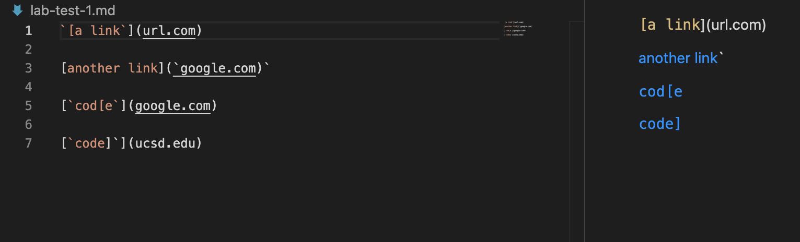
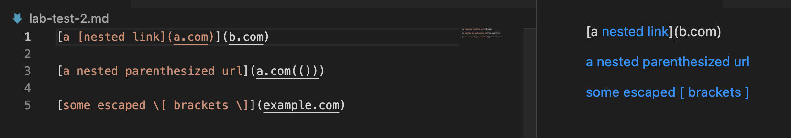
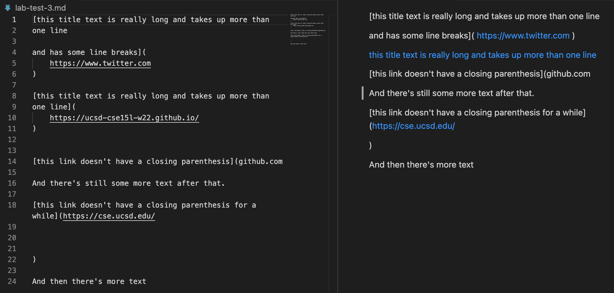
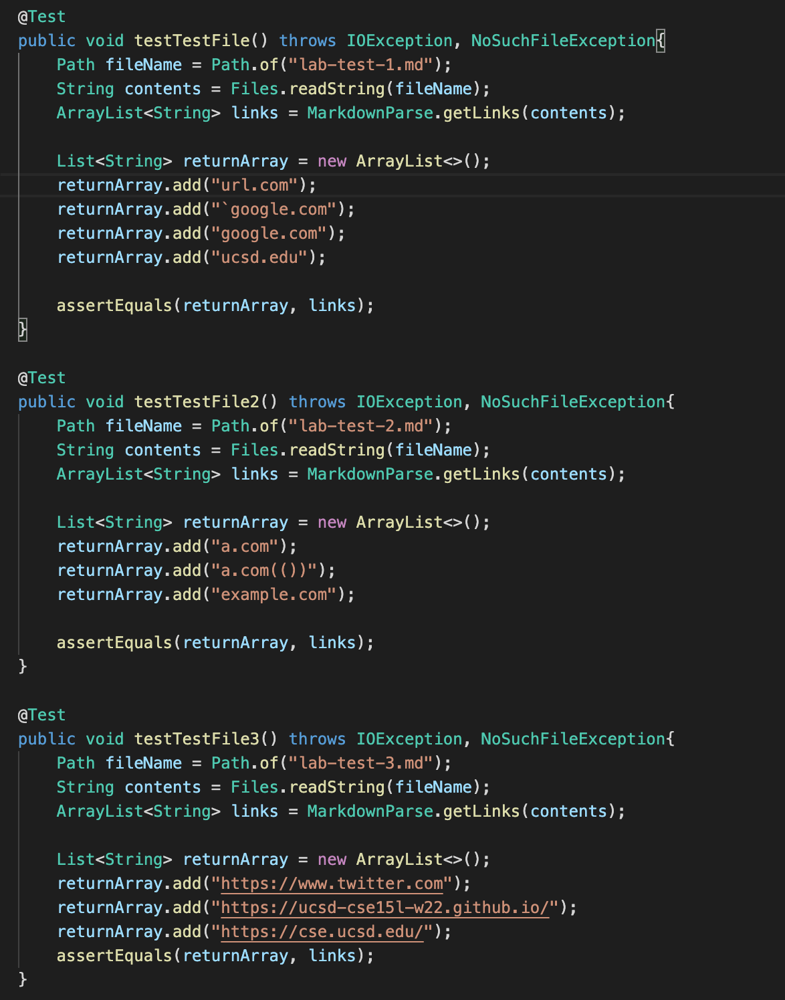
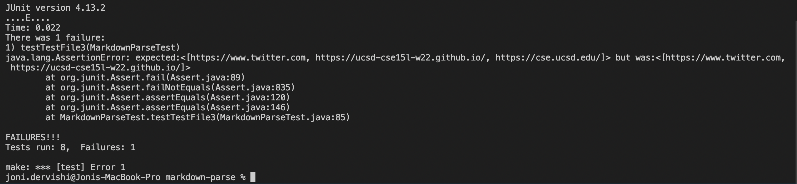
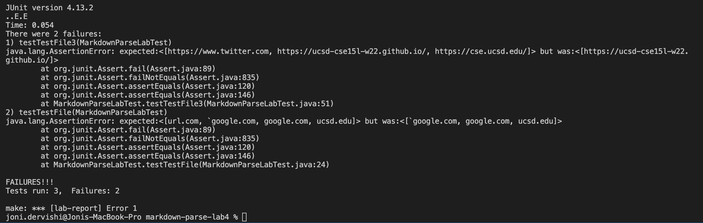

## Lab Report 4
### Links
[My Markdown Repository](https://github.com/jonidervishi/markdown-parse)
 
[Reviewed Repository](https://github.com/Stocktocon/markdown-parse)
### What should each test do?
In order to determine the answer to the question above, I simply entered the code in each test file into the VS code and toggled the preview display for each test file.
 
 
Snippet 1:

The lines in blue should have links to their respective urls, while the first line(not in blue) should not be a link and instead should just be text. The first link should go to "url.com", the second link should go to "'google.com", the third link should go to "google.com", and the fourth link should go to "ucsd.edu".
 
 
Snippet 2:

Again, only the text in blue should have a link to a url, while the other text does not have a link and will not redirect to one if clicked on. In the first line you can see that "nested link" is in blue meaning if you click on "nested link" it will direct you to a url, where as the rest of the text on that line will not redirect you anywhere if you click on it. That is because it is just basic text. The first link should go to "b.com", the second link should go to "a.com(())" and the third link should go to "example.com".
 
 
Snippet 3:

As you can see, this file has quite a bit of text, but should only have 3 links in total. The first link should go to "twitter.com", the second link to "ucsd-cse15l-w22.github.io", and the third to "cse.ucsd.edu".
 
 
### Testing MarkdownParse
In order to test both implementations of MarkdownParse on these files, I created 3 JUnit tests that will test if the expected output matches the actual output for each test. Here's the code for those tests:

I ran the tests on my implementation of MarkdownParse, and here were the results:

As you can see, for the third test file, my program did not pick up the last link, "cse.ucsd.edu" for a reason I will go into later. 
 
 
But first, I will show the same tests that were ran on the other student's implementation:

The other student's implementation failed on the first and third snippet. In the first one, it failed to grab "url.com" and in the third one it failed to grab "twitter.com" and "cse.ucsd.edu".
 
 
### Fixing the Code
(I will only be answering the third question, as the first and second tests passed :) )
 
For the third snippet, my code failed to pickup the link that had the closing parenthesis delayed for a couple of lines. In order to change my code in to making it possible to pickup a closing parenthesis on another line, it would have to be more than 10 lines of code in order for the code to work for snippet 3. This is because I would need to add something in my code in order to take into account the break in lines when the file gets read by the .readString method.