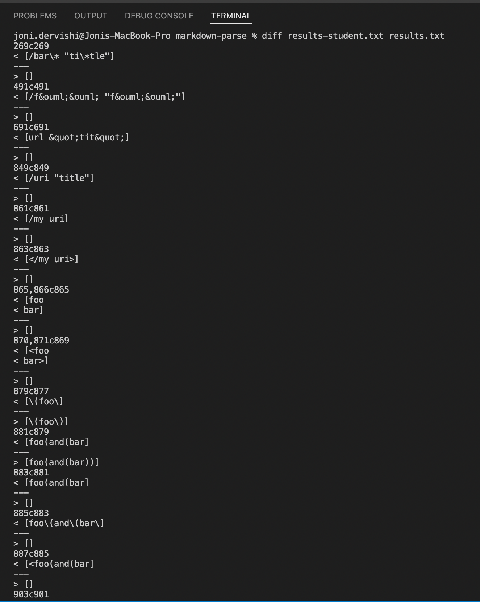
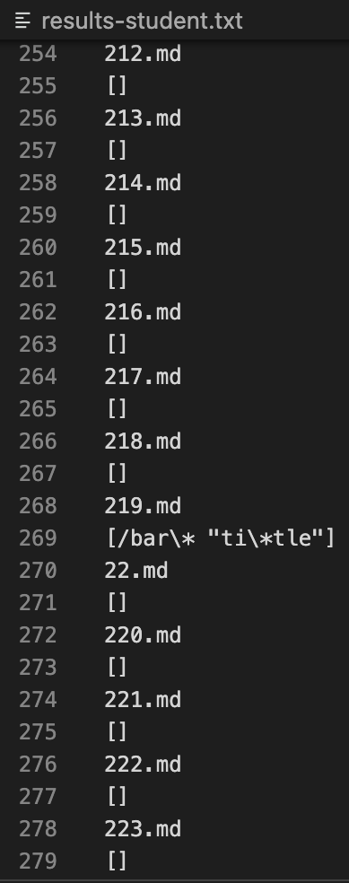
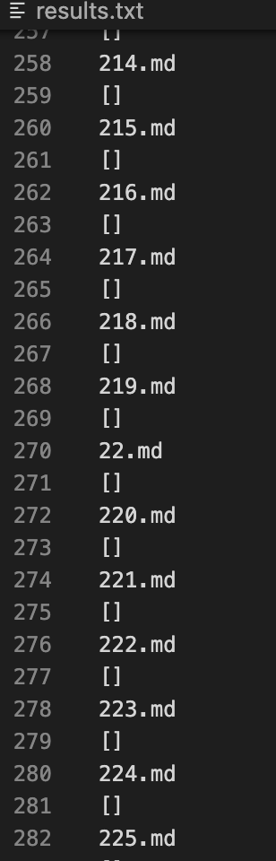
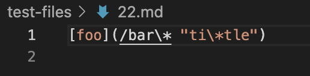
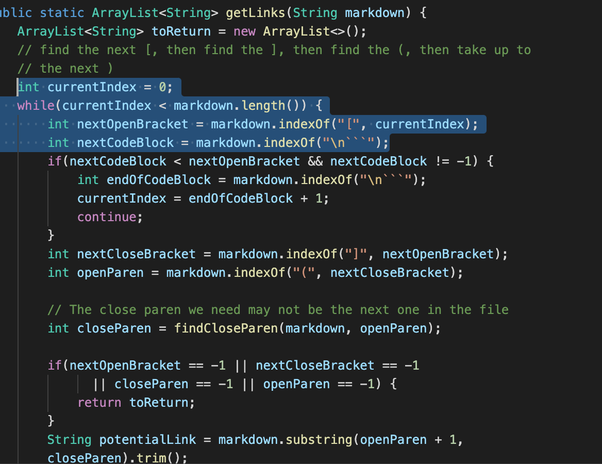
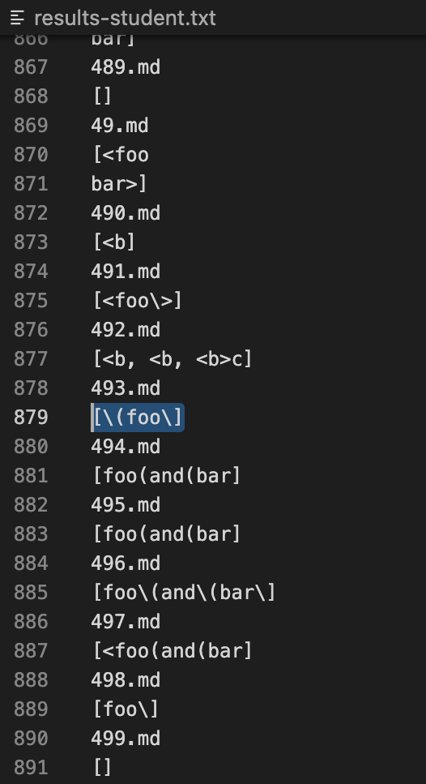
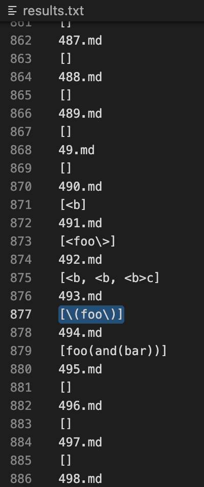
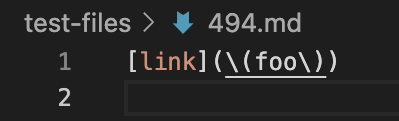
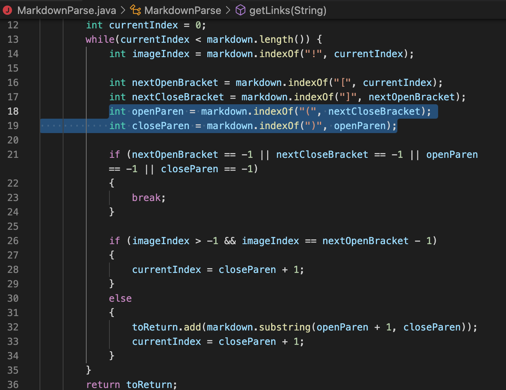

## Week 10 Lab Report
### Finding the differences in the 652 test files
The way I found the differences in at least two test files, was I simply used the diff command to compare the two results.txt files.

As you can see from the command line, I created two results.txt files, one from my student-made version of MarkdownParse, and the MarkdownParse that was provided to me. I then used the ***diff*** command in the terminal to compare the results, and these were the resulting different lines. 
<br/>
<br/>
Let's go through two tests in which the results were different and determine which implementation produced the expected output or, if neither of them did.
### Test 1: File #22
For test file #22, my implementation of markdown parse was able to pick up a link as shown here:

<br/>
However, in the results file of the markdown parse provided to me, the results file did not show anything for file 22, as already made clear by the diff command: 
<br/>

<br/>
So, my markdown parse picked up "[/bar\* "ti\*tle]" while the provided markdown parse picked up nothing. Let's see what test file #135 actually looks like, and determine which output was wrong, or if they're both wrong.
<br/>
Here is test file #22:

As we can see, it follows the format of a markdown link:
```
[text](link)
```
My implementation was able to pick up the entire link, while the given implementation was not, meaning the given implementation was incorrect in this case. Let's look at the code and see what we can fix in order to make it correct.
### What Went Wrong?
Given MarkdownParse:

In the highlighted portion of the code, we can see that in a while loop, a variable called **nextOpenBracket** is being initialized. The while loop is meant to iterate through each index of the strings in the file, which causes a mistake when initializing these variables. The variable nextOpenBracket is trying to get the index of the next "[" after the currentIndex in the String. However, if the currentIndex keeps moving forwards, in the case of file #22, it will never find another "[" since the only one is at the very beginning. This causes a problem later, as the if statement which returns "toReturn" if any of the indices are -1, is executed since that opening square bracket is not found, which means the indexOf method returns -1, and therefore the method returns an empty string almost immediately.
<br/>
<br/>
### Test 2: File #494
For test file #494, both implementations were able to pick up a link however, both are different. Here is what my implementation picked up:

As you can see, the highlighted message shows that my implementation picked up "[/(foo/]" as a link. ***(The backwards slashes were not showing up, so I just switches them to forward slashes for now :) )***
<br/>
The given implementation picked up something different:

<br/>
Here the link picked up is "[/(foo/)]" where there is a closing parenthesis.
<br/>
Let's see what the test file looks like in order to determine which implementation was wrong.

<br/>
As we can see, it follows the format of a markdown link:
```
[text](link)
```
However, the (link) part includes 2 parentheses inside, in which the link should be: "[/(foo/)]". Which means, that my implementation was wrong.
### What Went Wrong?
Given My MarkdownParse:

The issue is with the **closeParen** index which finds the next closing parenthesis after the opening parenthesis. The error is, since the next ")" comes before the last ")" in the link, the program will think that the link ends earlier than it actually does. It will end the link at the first closing parenthesis instead of the last one, resulting in the one parenthesis missing. 