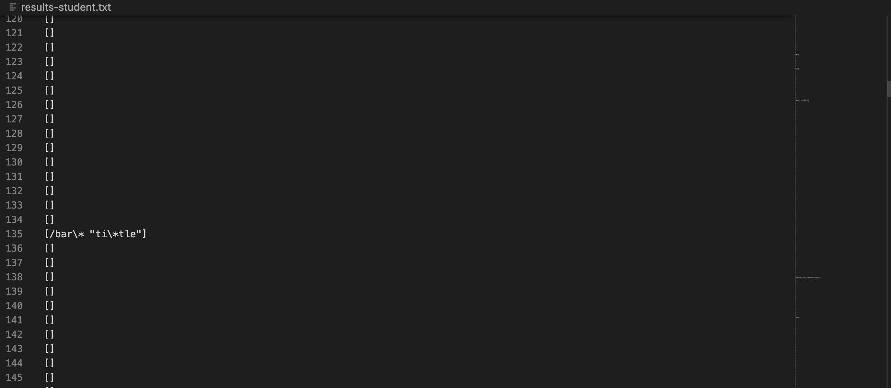
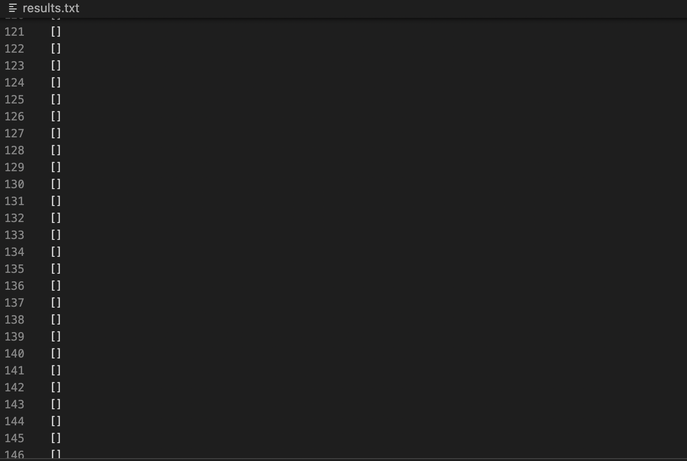

## Week 10 Lab Report
### Finding the differences in the 652 test files
The way I found the differences in at least two test files, was I simply used the diff command to compare the two results.txt files.

As you can see from the command line, I created two results.txt files, one from my student-made version of markdown, and the markdown that was provided to me. I then used the diff command in the terminal to compare the results, and these were the resulting different lines. 
 
 
Let's go through two tests in which the results were different and determine which implementation produced the expected output or, if neither of them did.
### Test 1: File #135
For test file #135, my implementation of markdown parse was able to pick up a link as shown here:

However, in the results file of the markdown parse provided to me, the results file did not show anything on line 135: 

So, my markdown parse picked up "[/bar\* "ti\*tle]" while the provided markdown parse picked up nothing. Let's see what test file #135 actually looks like, and determine which output was wrong, or if they're both wrong.
Here is test file #135