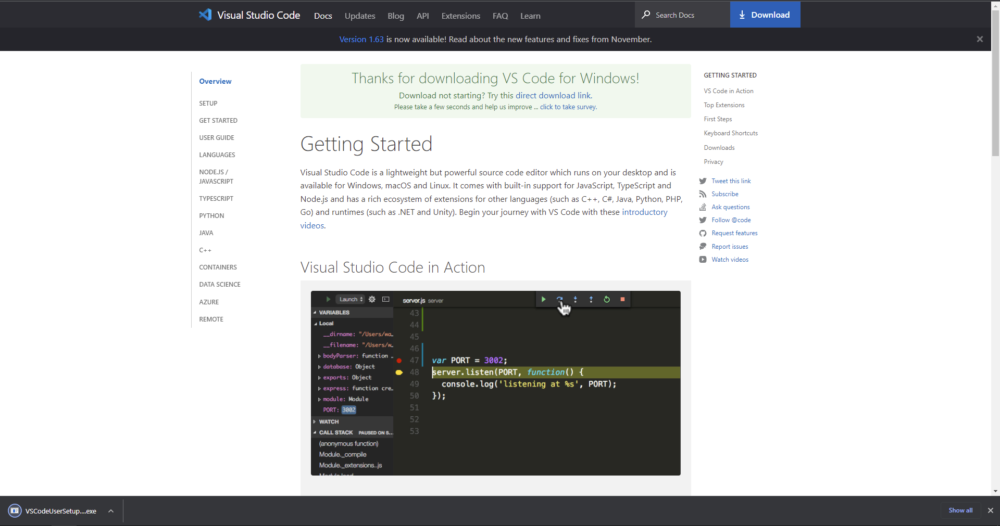
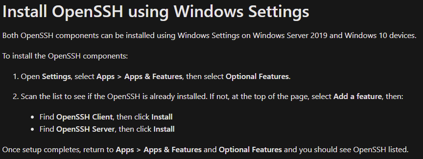
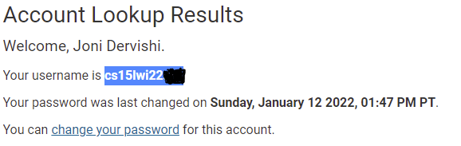
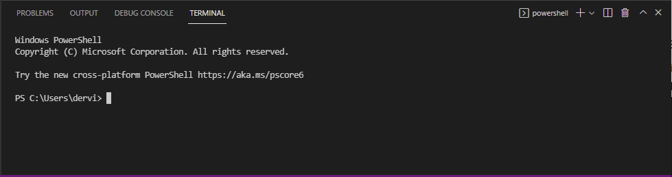
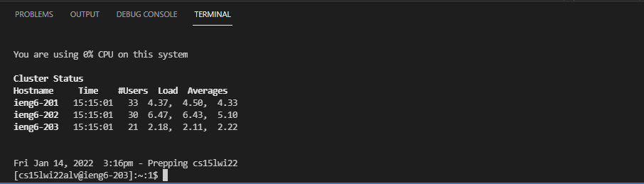
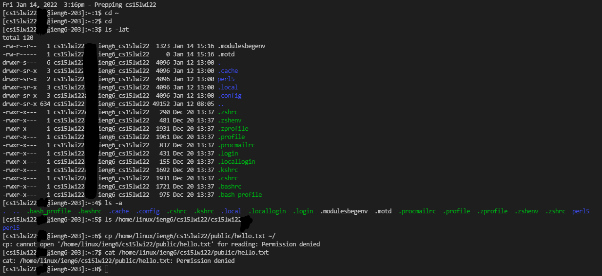
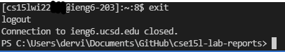
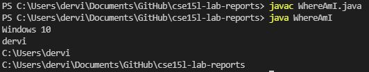
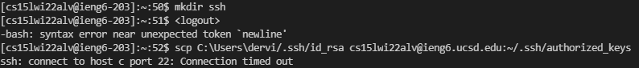

##  Week 2 Lab Report
Today, I am going to teach you how to remotely connect your computer all the way to your own individually assigned computer in the CSE basement at UCSD. 

First, you need to go on over to this [link](https://code.visualstudio.com/) and download Microsoft Visual Studio Code.

You may need to sign in or create an account in order to open the program.
***
Next, you're going to want to install [OpenSSH](https://docs.microsoft.com/en-us/windows-server/administration/openssh/openssh_install_firstuse) which will allow you to make connections to that computer I mentioned earlier at UCSD. The instructions are pretty straight forward and might already be installed on your computer.

After you've got those two installed, it's time to get the address of which computer you will be connecting to. In order to do that, you need to visit the [account lookup](https://sdacs.ucsd.edu/~icc/index.php) page. Once you're there sign in and click on the button that says "***cs15l***" and then a bunch of characters. If you see a message saying that your ***password is not set***, click on that link in order to reset your password and have a password to sign in remotely to that server. Once you have done that wait 15 minutes and then try the following:
* Copy the username at the top of the page where it says your username is ...

* Next, open a terminal in visual studio code by clicking on the top left, "***Terminal***", then "***New Terminal***". You should see this window popup on the bottom of your screen:

* After that, type in the Terminal ***ssh [your username copied from earlier]@ieng6.ucsd.edu*** and hit enter.
* You should then see a message that might ask you if you are sure you want to connect. Type "***yes***" and then press enter.
* You will then see a prompt for your password. Enter in the password you set earlier, if you didn't set a password either check again to see if you need to make one or enter in your password for your school account. Note: When typing in your password, ***the terminal will remain blank, as if nothing is being typed in.***. This is purely for security and you are still typing in even though you don't see it. Just type carefully and press enter once you have entered your password. Again, ***you should not see your password being typed in as you type it.***
* After you hit enter, you should see some messages automatically pop up until you reach the bottom of the messages which should look like this:

If you see that, then congratulations! You have connected your computer to your individual server at UCSD! Now, lets see what exactly we can do now that we have our computers connected.
***
First, let's try some random commands and we'll try and figure out what they mean.
Try these: 
* cd ~
* cd
* ls -lat
* ls -a
* ls /home/linux/ieng6/cs15lwi22/(your username), 
* cp /home/linux/ieng6/cs15lwi22/public/hello.txt ~/
* cat /home/linux/ieng6/cs15lwi22/public/hello.txt
* You should see these messages pop up:

You can also stop the connection by typing ***exit*** in the terminal.

Now, we will see how to send files from our computer onto the UCSD computer we have made our connection to. To do this, we will make a file to send to our server. 
* In the top of left of Visual Studio Code, press ***File*** and then ***New File**
* Click on "***Select a language***" then type in ***Java*** and select ***Java*** from the drop down menu. 
* Then copy paste this code into your file and save it as ***WhereAmI.java***:
***
`class WhereAmI {
  public static void main(String[] args) {
    System.out.println(System.getProperty("os.name"));
    System.out.println(System.getProperty("user.name"));
    System.out.println(System.getProperty("user.home"));
    System.out.println(System.getProperty("user.dir"));
  }
}`
***
*Side note: I am skipping the "run it on java step" for simplicity sake*
***
* Then in the terminal, type ***scp WhereAmI.java (your username)@ieng6.ucsd.edu:~/***
* The terminal should prompt you for your password again, enter it.
* You should see a success message. Once you get this, close the terminal and initiate the login process again using the ***ssh*** command from before.
* Once your logged back in, type in the code ***ls*** and you should see that the file "WhereAmI.java" is there. Congratulations, you've copied your first file!
* You can then run the program by typing ***javac WhereAmI.java*** and hitting enter and then typing ***java WhereAmI***.
* You should see this:

***
*Side note for grader: SCP was giving me a permission denied error that I couldn't fix so I put this in as consolation*
***
Now that we know what the scp command does, we should also know that everytime use the command you have to re-enter your password. This can be extremely time consuming and tricky at times. However, there is a way to get around this called ssh-keygen which creates a public and private "key" on the server you are connected to and on your computer. These are used in place of your password so that you don't have to re-enter your password everytime you use an scp command.
* First logout of the server using ***exit***.
* In the terminal, type ssh-keygen and hit enter.
* For choosing which file you want to say the key at, simply press enter and it will be at the location in the parentheses. However, copy the file location inside the parentheses as we will need it later.
* Choose a passcode or simply hit enter if you don't want a passcode and re-enter it.
* You should get a message that looks like this:\

* After that, login into the ssh client again.
* Next you will be doing the same step which is copying the file into the server again. Use the command ***mkdir ssh*** first.
* Then use the command ***scp (file location you copied) (username)@ieng6.ucsd.edu:~/.ssh/authorized_keys***
* After this, you can now use the scp command without having to re-enter your password everytime.
***
*Side note to grader: Again, I ran into problems earlier and I think it may be server-side problems, when I tried to scp my key file to the server it told me connection timed out after 10 minutes plus of waiting.*

***
Here are a few tips to use in the future:
* You can write commands after the login command ssh in order to run commands immediately after logging in. 
* Example: ssh cs15lwi22@ieng6.ucsd.edu "cd"
* You can also split up multiple commands on the same command line in the terminal in order to run multiple commands at once.
* Example: cp minecraft.java; javac minecraft.java; java minecraft
* And finally, you can use the up arrow to use your last command.