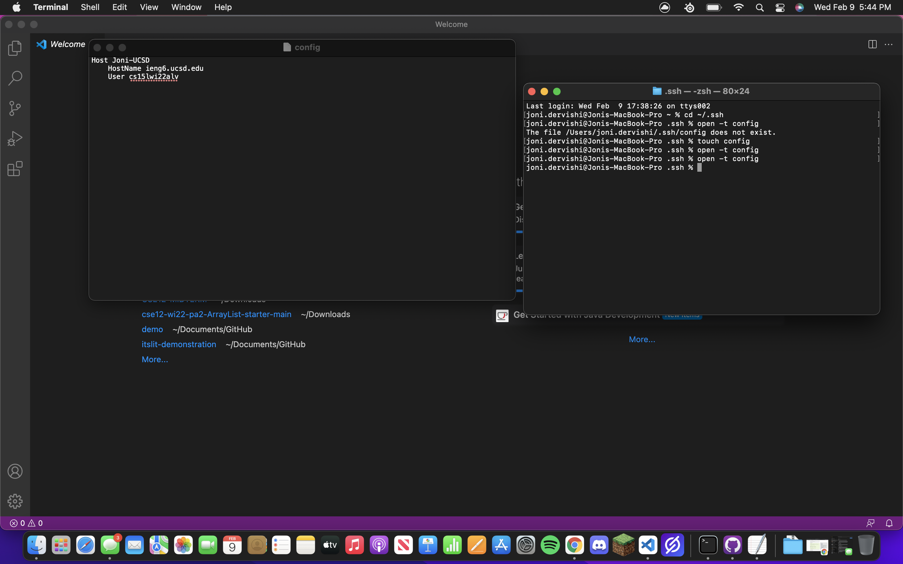
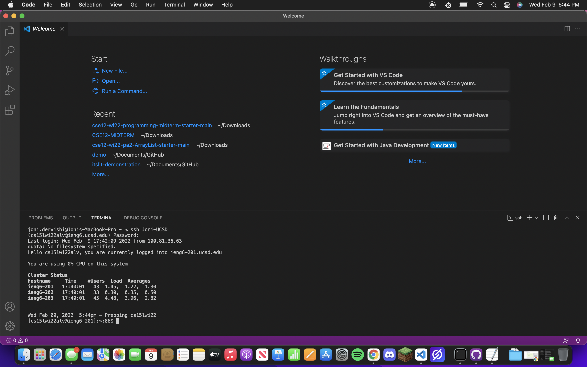
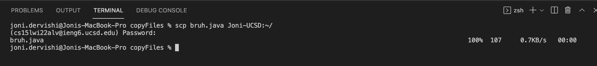

## Week 6 Lab Report
### Editing My .ssh/config file
Here is my .ssh config file, I used the mac terminal to create one and edit it:

I used the commands:
<br />
```
cd ~/.ssh 
touch config
open -t config
```

"cd ~/.ssh" sets the terminal's directory to the ssh file on my computer. "touch config" then creates a new ssh config file which I then can edit using the "open -t config" command which opens a text editor in which I can edit the config file I just created.
I then entered the following into the config file:
```
Host Joni-UCSD
    HostName ieng6.ucsd.edu
    User cs15lwi22000
```
This creates the new alias "Joni-UCSD" which allows me to sign in to the username "cs15lw22000"(000 are the 3 characters unique to each user) through the HostName ieng6.ucsd.edu. So instead of having to enter:
```
ssh cs15lwi22000@ieng6.ucsd.edu
```
I can now just enter:
```
ssh Joni-UCSD
```
which streamlines the process of connecting to the ssh server.
<br />
<br />
### Logging In Using New Alias
Here is me logging in with my new alias:

I simply enter this into the terminal and I login:
```
ssh Joni-UCSD
```
Not only can you login with this new alias but now you can use it to run various commands, like when copying a file to the server.
<br />
<br />
### Copying A File To The Server Using New Alias
Using the new alias: I can now also use the scp command with my alias to copy a file to the ssh server. In this case, I will copy a file named bruh.java.

Without signing into the ssh server just yet, you can simply enter:
```
scp fileName.extension Alias:(directory)
```
and using the new alias, you can copy a file to your server.